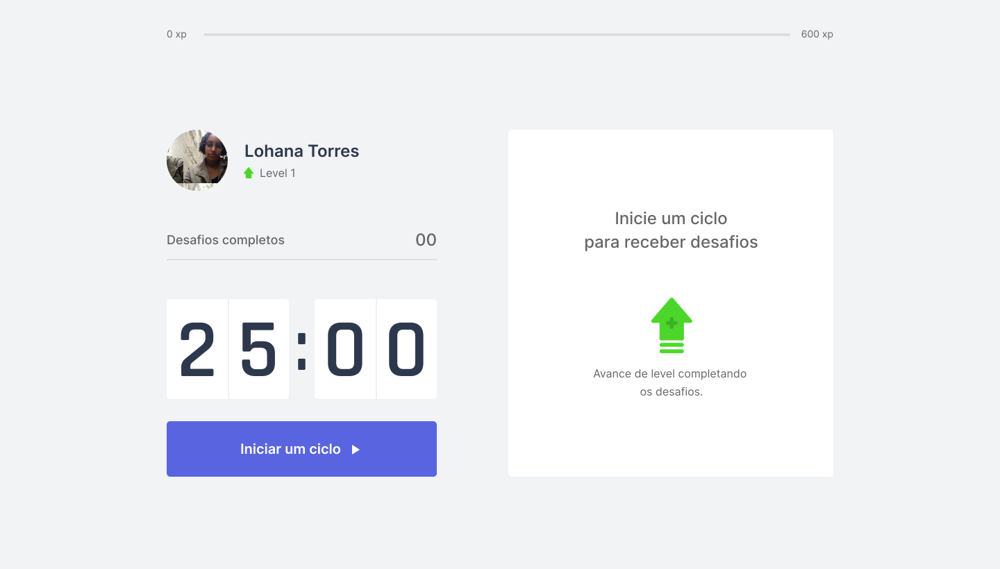
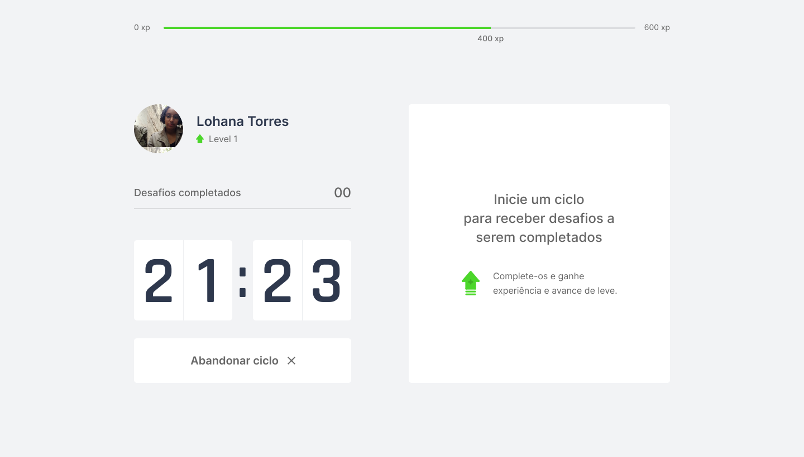
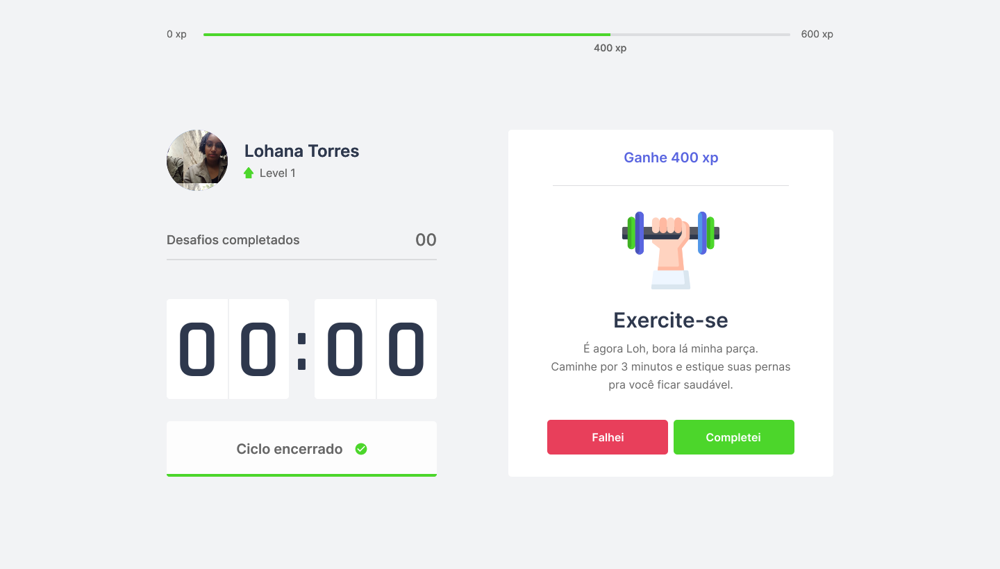

<h1 align="center">
   
  
   
</h1>

  <strong>Next.js project for <a href="https://nextlevelweek.com/convite/heyloh">NLW#04</a></strong>
   
  See the deploy at <a href="https://letsjustmoveit.vercel.app/">Vercel</a> 🚀 

  <a href="#layout">Layout</a> •
  <a href="#techs">Technologies</a> •
  <a href="#author">Author</a> •
  <a href="#license">License</a>

  

## Layout

See more details with the prototype on [Figma](https://www.figma.com/file/ge20pu3ofMOKoliUyKx1Nl/Move.it-1.0/duplicate).

  
  

  
  

## Technologies

- [React.js](https://reactjs.org)
- [Next.js](https://nextjs.org/)
- [TypeScript](https://www.typescriptlang.org/)

> See [`package.json`](./package.json) for more details.

## Author

|  |
| ------------------------------------------------------------------------------------- |
| [Lohana Torres](https://github.com/heyloh)                                            |

## License

[MIT License](./LICENSE.md)
